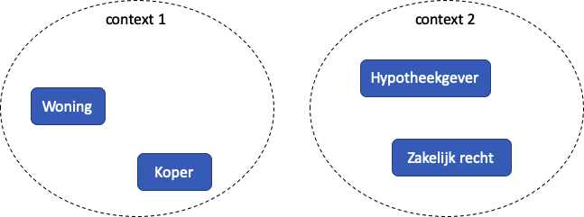
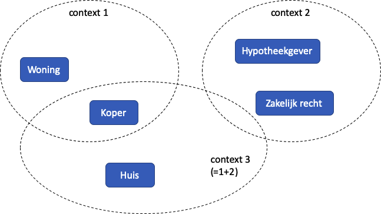

# Contexten

Voor succesvolle samenwerking is het belangrijk dat we elkaar goed verstaan. Elke partner in de samenwerking kent haar eigen context en kent vanuit deze context aan de gebruikte terminologie een betekenis.

Vandaar dat we begrippen definiëren: zo weten we wat we bedoelen, en kunnen we verschillen in betekenis van de gebruikte terminologie snel opsporen.

Bij de start zullen deze contexten los van elkaar zijn beschreven: dezelfde woorden kunnen zo worden gebruikt voor verschillende zaken in verschillende contexten, of juist andere woorden die (ongeveer) hetzelfde betekenen.

In een samenwerking ga je uiteindelijk de woorden van elkaar gebruiken: je zult wel moeten, je gaat met elkaar communiceren. Dit kan er toe leiden dat je de betekenis van de ander overneemt: in de samenwerking wordt de betekenis uit één context dominant. Ook kan het gebeuren dat vanuit de samenwerking nieuwe woorden met een nieuwe betekenis ontstaan, mogelijk de generalisatie van bepaalde begrippen die in de eigen context al bestonden.

