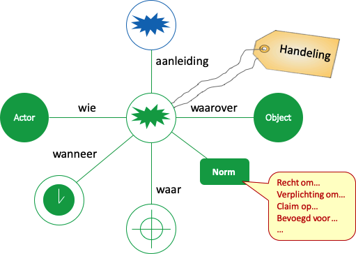

# Handelingen

Voor succesvolle samenwerking is het belangrijk dat we elkaar goed verstaan. Elke partner in de samenwerking kent haar eigen context en kent vanuit deze context aan de gebruikte terminologie een betekenis.

Vandaar dat we begrippen definiëren: zo weten we wat we bedoelen, en kunnen we verschillen in betekenis van de gebruikte terminologie snel opsporen.

Het is gebruikelijk om daarbij in eerste instantie te denken aan de zelfstandignaamwoorden: de onderwerpen waarover we praten. Maar minstens zo belangrijk zijn de handelingen die we in de samenwerking uitvoeren. En dit zijn juist vaak geen zelfstandignaamwoorden, hoewel je van de handeling vaak wel een zelfstandignaamwoord kunt maken (betalen wordt dan betaling, etc).

Wet- en regelgeving gaat vooral over het stellen van normen aan de handelingen die we als mensen of rechtspersonen uitvoeren of willen uitvoeren. De wet- en regelgeving gaat primair over deze handelingen, de onderwerpen zijn slechts noodzakelijk om de handeling te duiden.

[SKOS-LEX](https://bp4mc2.org/profiles/#skos-lex-toepassingsprofiel-voor-rechts-handelingen) is een uitbreiding van SKOS waarin de handeling centraal staat. Elke handeling ([skoslex:Act](http://bp4mc2.org/def/skos-lex#Act)) is een begrip waarmee een handeling wordt gedefinieerd, uitgevoerd door één of meerdere actoren ([skoslex:Actor](http://bp4mc2.org/def/skos-lex#Actor)) op één of meerdere objecten ([skoslex:Object](http://bp4mc2.org/def/skos-lex#Object)). Ook actoren en objecten zijn begrippen.

In een samenwerkingsketen volgen handelingen elkaar op: de ene handeling is de aanleiding voor het starten van de volgende handeling. Deze keten van handelingen beschrijft de samenwerking. De actoren van de handelingen vervullen een rol binnen deze samenwerking, en de objecten betreffen hetgeen wordt uitgewisseld bij de samenwerking. Op deze wijze is duidelijk welke begrippen relevant zijn in de samenwerking en kan gecontroleerd worden of sprake kan zijn van een succesvolle samenwerking (dwz: er is sprake van een betekenisvolle, door iedereen begrepen keten van begrippen), of dat er nog onduidelijkheden zitten (bijvoorbeeld omdat handelingen of objecten niet overeen komen bij opvolgende handelingen).
