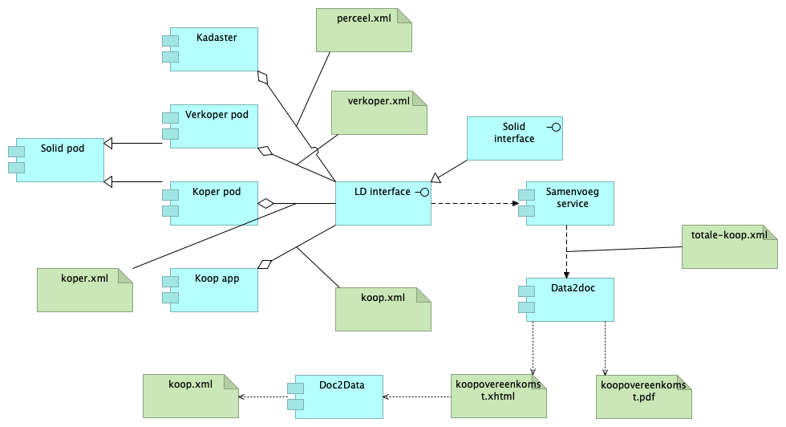

De opzet van de demo is:

1. Diverse bronnen kunnen gegevens aandragen voor de Koopovereenkomst. In ons prototype gaan we er vanuit dat elk van deze bronnen conform een LD interface en conform de ZVG ontologie gegevens aanbieden;
2. We voorzien in ieder geval de volgende bronnen:
  - Informatie uit authentieke bronnen (bv Kadastrale informatie);
  - Informatie uit eigen beheer van verkoper en/of koper;
  - Informatie die ontstaat bij het opstellen van de Koopovereenkomst zelf.
3. Deze gegevens wordt samengebracht tot één set van gegevens over de Koop(overeenkomst). Onderdeel van deze gegevens zijn ook de meta-gegevens, dwz: de herkomst (provenance) gegevens: uit welke bron, op welke moment, etc, etc zijn de gegevens opgehaald.
4. Vanuit deze gegevens wordt de Koopovereenkomst opgesteld, in een XHTML document, waarbij (via rdfa) ook de gegevens zelf ingevoegd (embedded) zijn. Via een technische vertaling kan dit ook in een PDF worden gegoten.
5. Het resultaat (de xhtml) kan vervolgens weer opgenomen worden in de eigen administratie, zowel als leesbaar document (xhtml in een browser) als de gestructureerde data.
6. Vanzelfsprekend is dat de gestructureerde data die ingevoegd zit in de xhtml-koopovereenkomst exact gelijk is (moet zijn) aan de oorspronkelijke gegevens die gebruikt zijn om tot het originele document te komen.

In een uiteindelijke oplossing zal bovenstaande volledig servicegebaseerd machine-to-machine kunnen zijn. Voor de demo/prototype wordt gewerkt met bestanden die ingelezen worden en waaruit output-bestanden ontstaan.

Ten behoeve van de demo zullen al deze bestanden in deze map worden geplaatst.
