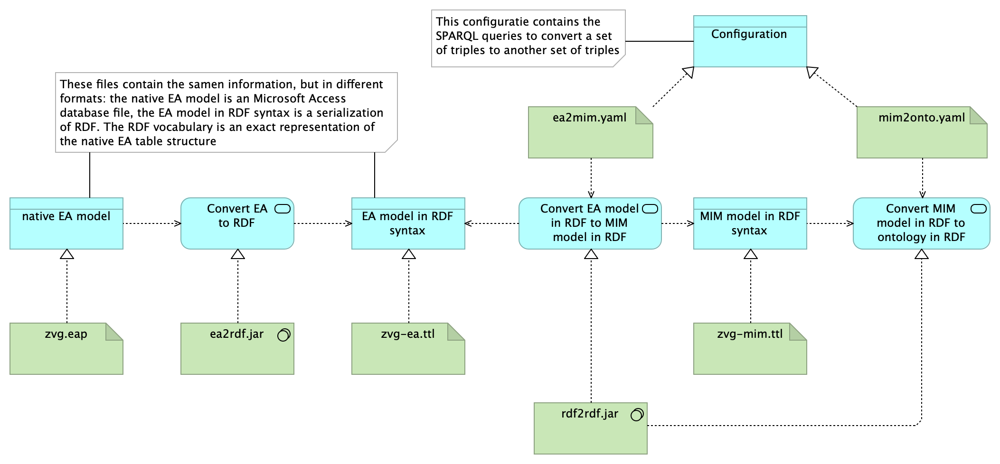

# Generation pipeline

Deze pipeline beschrijft hoe je vanuit een Enterprise Architectuur bestand (zvg.eap of zvg.eapx) de conversie kunt doen naar de MIM serialisatie (LD variant) en naar een LD ontologie in RDFS/OWL/SHACL.

> TODO: Generatie van plaatjes op basis van de LD ontologie

Noodzakelijke jar bestanden hiervoor zijn:
- ea2rdf.jar in https://github.com/architolk/ea2rdf/releases/tag/v1.0.0 (conversie van EAP bestand naar turtle conform EA vocabulaire);
- rdf2rdf.jar in https://github.com/architolk/rdf2rdf/releases/tag/v1.0.0 (conversie van RDF conform de ene vocabulare (EA of MIM) naar de andere (MIM of RDFS/OWL/SHACL));

De flow ziet er dan uit conform onderstaand plaatje:

Het bestand pipeline.sh geeft een werkende versie. Daarbij wordt het [zvg.EAP](../ea/zvg.EAP) bestand als input-bestand gebruikt.
