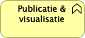

# Tool requirements

## Capabilities: typen informatie versus beheerfuncties

Het beheer van de informatie in een gegevenscatalogus voor Zorgeloosvastgoed omvat de volgende drie typen informatie:

1. De **taxonomie** / thesaurus voor Zorgeloosvastgoed, met alle relevante begrippen, de uitleg hierover en de relaties tussen begrippen, inclusief de verwijzingen naar de relevante wet- en regelgeving.
2. De beschrijving van de **datasets** die beschikbaar zijn binnen het domein van Zorgeloosvastgoed en waaruit informatie uitgewisseld kan worden via informatieproducten of -services.
3. De **informatiemodellen** die een beschrijving geven met welke structuur de datasets zijn opgebouwd, inclusief een beschrijving van de betekenis van de afzonderlijke gegevenselementen in deze datasets. Deze beschrijving van de betekenis bestaat onder meer uit een verwijzing naar de begrippen uit de taxonomie van Zorgeloosvastgoed.

Het beheer van elk van deze typen informatie kan onderverdeeld worden in een aantal beheerfuncties:

1. **Invoeren en wijzigen** van informatie in de catalogus.
2. **Colleboratie en opslag** van verschillende versies van de informatie in de catalogus. Collaboratie omvat de ondersteuning voor het delen van elkaars werk, reviews hierop uitvoeren, gecontroleerde processen voor het beoordelen, goedkeuren en publiceren van nieuwe versies. Deze functie omvat ook het kunnen aangeven van issues met betrekking tot de informatie in de catalogus en het toewijzen van issues aan personen die hier vervolgens mee aan de slag gaan.
3. **Publicatie en visualisatie** van de informatie in de catalogus. De informatie zal getoond moeten worden, waarbij visualisaties nodig zijn om voor verschillende doelgroepen en vanuit verschillende invalshoeken naar de catalogus te kunnen kijken. Hieronder valt ook het kunnen zoeken in de catalogus.
4. **Controle en validatie** van de informatie in de catalogus. Voordat informatie als definitief gepubliceerd kan worden, is van belang dat controles uitgevoerd kunnen worden zodat de consistentie van de informatie in de catalogus gewaarborgd is.
5. **Delen van voorschriften** tussen auteurs van informatie in de catalogus. Bij het invoeren en wijzigen van informatie is het van belang dat alle auteurs dezelfde voorschriften hanteren, zodat een eenduidige catalogus ontstaat. Er is een hulpmiddel nodig om deze voorschriften te kunnen tonen en te bewerken, verbonden met de plek waar de voorschriften nodig zijn.

Door deze 5 functies en 3 typen informatie tegen elkaar uit te zetten, ontstaan 15 vlakken die betrekking hebben op de ondersteuning die een tool kan leveren. Afhankelijk van het belang dat een organisatie hecht aan een specifieke functie of type informatie, kan vervolgens gekeken worden wat de meeste urgentie heeft en de meest rijke (of juist minste) toolondersteuning nodig heeft.

|                                     |                  |                  |                  |
|-------------------------------------|------------------------------------------|-----------------------------------------|---------------------------------------------------|
|      |[1.1](taxonomie/InvoerenWijzigen.md)      |[2.1](datasets/InvoerenWijzigen.md)      |[3.1](informatiemodellen/InvoerenWijzigen.md)      |
|    |[1.2](taxonomie/CollaboratieOpslag.md)    |[2.2](datasets/CollaboratieOpslag.md)    |[3.2](informatiemodellen/CollaboratieOpslag.md)    |
||[1.3](taxonomie/PublicatieVisualisatie.md)|[2.3](datasets/PublicatieVisualisatie.md)|[3.3](informatiemodellen/PublicatieVisualisatie.md)|
|     |[1.4](taxonomie/ControleValidatie.md)     |[2.4](datasets/ControleValidatie.md)     |[3.4](informatiemodellen/ControleValidatie.md)     |
|    |[1.5](taxonomie/DelenVoorschriften.md)    |[2.5](datasets/DelenVoorschriften.md)    |[3.5](informatiemodellen/DelenVoorschriften.md)    |

Op dit moment ligt de focus op de taxonomie. In onderstaand figuur is afgebeeld hoe de huidige toolondersteuning is geregeld. Een lege cel geeft aan dat dit onderdeel nog niet is opgepakt en hier dan ook nog geen ondersteuning voor is ingericht.

|                                     ||||
|-------------------------------------|------------------------|-----------------------|---------------------------------|
|      |Beperkt (github editor) |                       |                                 |
|    |Uitgebreid (github)     |                       |                                 |
||Behoorlijk (dotwebstack)|                       |                                 |
|     |Beperkt (reports)       |                       |                                 |
|    |Beperkt (github wiki)   |                       |                                 |

Hieruit is duidelijk dat op dit moment veel belang wordt gehecht aan de collaboratie en visualisatie van de taxonomie.

## Users

The [maintainer](users/maintainer.md) is a person who… *[yet to be defined???]*

Possible profiles in no particular order:
- otologists,
- taxonomists,
- linked data specialists,
- schema designers,
- developers,
- data engineers,
- information engineers,
- data analysts,
- domain knowledge, i.e. businesspeople from HDN, NVM, KNB en Kadaster (not technicians).

## Use cases

- [UC-1](use-cases/UC-1.md). Create a new concept and its properties.
- [UC-2](use-cases/UC-2.md). Edit existing concepts and its properties.
- [UC-3](use-cases/UC-3.md). Remove existing concepts and its properties.
- [UC-4](use-cases/UC-4.md). Export taxonomy.
- [UC-5](use-cases/UC-5.md). Define universal identifiers.
- [UC-6](use-cases/UC-6.md). Online human-readable description.
- [UC-7](use-cases/UC-7.md). Link concepts.
- [UC-8](use-cases/UC-8.md). Visualize taxonomy.
- [UC-9](use-cases/UC-9.md). Publish taxonomy.
- [UC-10](use-cases/UC-10.md). Share with others.
- [UC-11](use-cases/UC-11.md). Request for approval.
- [UC-12](use-cases/UC-12.md). Add an ontology.
- [UC-13](use-cases/UC-13.md). User management and user rights.
- [UC-14](use-cases/UC-14.md). Import taxonomy.
- [UC-15](use-cases/UC-15.md). To validate taxonomy.
- [UC-16](use-cases/UC-16.md). Search and browse.
- [UC-17](use-cases/UC-17.md). Add user-defined comments.
- [UC-18](use-cases/UC-18.md). Provide examples.

## Functional requirements

## Non functional requirements
